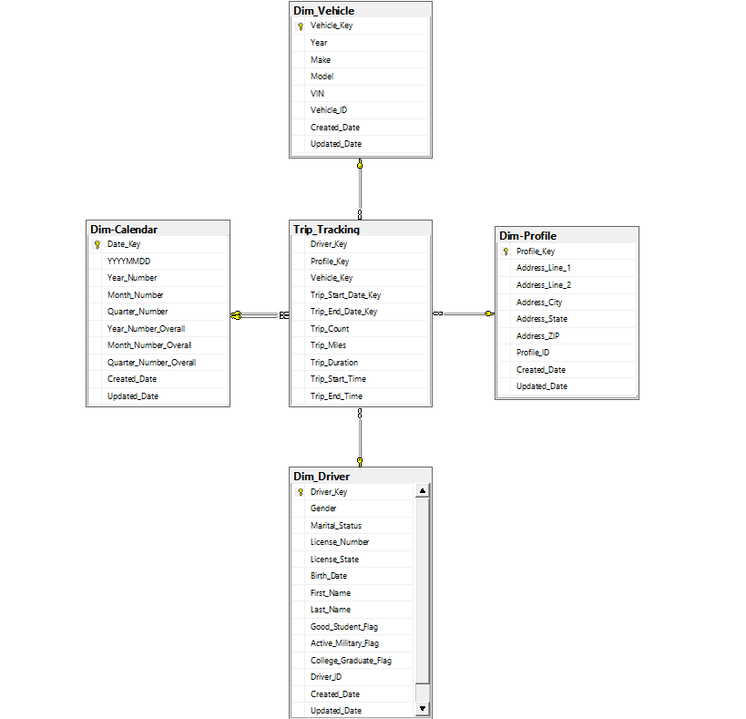

# Trip Tracking Star Schema
#### Here is a sample star schema based on the limited information provided:

### Note:
1. Trip duration (calculated as Started_at – Ended_at)
2. Trip Count (Set equal to 1) so can be by users
3. Driver_ID, Vechile_ID and Profile_ID are the Degenerative keys for the respective tables Dim_Driver, Dim_Vehicle and Dim_Profile.
